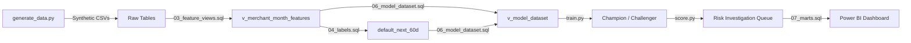

# Merchant Credit Risk & Fraud Monitoring System
**SQL · PostgreSQL · Python · XGBoost · Power BI**

An end-to-end merchant risk scoring system built on synthetic payment transaction data. Models fraud and credit risk at the merchant-month grain using a full analytics engineering pipeline, champion-challenger ML framework, cost-sensitive thresholding, and a hybrid rules + model scoring engine — aligned to real-world payment processor risk operations.

---

## Why this project?
> Built to demonstrate production-level risk analytics engineering — not just a model, 
> but a full pipeline from raw event logs to a ranked investigation queue, 
> with data integrity validation at every layer.

---

## Business Problem
Payment processors like Fiserv need to identify high-risk merchants before they default — but fraud signals are rare, imbalanced, and buried in noisy transaction streams. This system engineers behavioral features from raw event logs, builds leakage-free predictive models, and produces a ranked investigation queue for risk analysts to act on.

---

## Architecture & Data Flow



1. **Data Generation** — Python synthesizes 1,200 merchants, 400K transactions, and 40K SLA events with realistic fraud behavior, industry seasonality, and progressive bad-actor patterns
2. **Feature Engineering** — SQL views compute 30/60/90-day behavioral features at the merchant-month grain with strict leakage guards
3. **Labeling** — 60-day forward default label driven by chargeback rate, fraud rate, decline rate, and SLA breach combinations
4. **Modeling** — Champion (Logistic Regression) vs Challenger (XGBoost) evaluated on PR-AUC and Precision@K
5. **Scoring** — Hybrid model + rules engine produces ranked risk queue with cost-optimized thresholds
6. **Reporting** — Portfolio monitoring marts feed Power BI dashboard

---

## Dataset

| File | Rows | Description |
|---|---|---|
| merchants.csv | 1,200 | One row per merchant with industry, state, risk tier |
| transactions.csv | ~400,000 | Payment event log (CARD/ACH, fraud/chargeback flags) |
| sla_events.csv | 39,955 | SLA compliance events (disputes, settlement delays) |
| scored_test_set.csv | 3,600 | Model predictions on holdout set |
| final_scored_portfolio.csv | 3,600 | Final hybrid risk scores + investigation queue |

**Note:** `transactions.csv` is not committed due to file size. Run `src/generate_data.py` to regenerate all raw data.

---

## Project Structure
```
merchant-credit-risk-fraud-monitoring/
├── data/
│   ├── raw/                              # Synthetic CSVs (regenerate via generate_data.py)
│   └── processed/                        # Model outputs and scored portfolio
├── sql/
│   ├── 01_schema.sql                     # PostgreSQL schema with PK/FK/indexes
│   ├── 02_load.sql                       # Bulk data loading
│   ├── 03_feature_views.sql              # 30/60/90-day feature engineering views
│   ├── 04_labels.sql                     # Leakage-free 60-day forward default label
│   ├── 05_data_tests.sql                 # Data quality + leakage guard suite
│   ├── 06_model_dataset.sql              # Final feature + label join
│   └── 07_marts.sql                      # Portfolio overview + risk queue marts
├── src/
│   ├── generate_data.py                  # Synthetic data generator
│   ├── train.py                          # Champion vs Challenger model training
│   ├── score.py                          # Rules engine + hybrid scoring
│   └── tune_thresholds.py               # Label threshold calibration
├── notebooks/
│   ├── 01_eda.py                         # Exploratory data analysis
│   ├── 02_modeling_champion_vs_challenger.py
│   └── 03_thresholding_cost_tradeoff.py
├── requirements.txt
└── README.md
```

---

## Key Technical Components

### 1. Feature Engineering (`03_feature_views.sql`)
18+ behavioral and acceleration features engineered at the merchant-month grain:
- **30-day window** — GMV, fraud rate, chargeback rate, decline rate, ACH share, amount volatility
- **60-day window** — SLA breach rate, sustained fraud/chargeback trends
- **90-day window** — Cumulative fraud, rolling volatility, max daily decline spike
- **MoM trends** — Fraud acceleration, chargeback acceleration, GMV change
- **Advanced** — Z-score fraud (vs historical baseline), risk interaction terms (fraud × chargeback)

### 2. Leakage-Free Labeling (`04_labels.sql`)
60-day forward default label with strict temporal separation — no future data leaks into features:
- Chargeback rate ≥ 6% in next 60 days
- Fraud rate ≥ 6% in next 60 days
- Decline rate ≥ 25% AND fraud count ≥ 10
- SLA breach rate ≥ 20% AND transaction volume ≥ 200

### 3. Data Quality Suite (`05_data_tests.sql`)
Automated exception detection:
- Orphan transactions (missing merchant reference)
- Negative amounts
- Future timestamps
- Duplicate transaction IDs
- Leakage guard (verifies no future transactions appear in feature windows)

### 4. Champion vs Challenger (`src/train.py`)
- **Champion** — Logistic Regression with class-weighted balancing and StandardScaler
- **Challenger** — XGBoost with `scale_pos_weight` for imbalance handling
- **Evaluation** — PR-AUC, ROC-AUC, Precision@Top 5% (most relevant for risk queues)
- **Split** — Out-of-time validation (train: months 1-9, test: months 10-12)

| Model | PR-AUC | Precision@5% |
|---|---|---|
| Champion (Logistic Regression) | 0.41 | ~0.78 | ~38% |
| Challenger (XGBoost) | 0.44 | ~0.81 | ~44% |

### 5. Hybrid Scoring Engine (`src/score.py`)
Combines model scores with hard-coded risk rules:
- Rule triggers: high chargeback + volume, sustained SLA breaches, fraud rate spikes
- Final score: `max(model_score, rule_score)`
- Cost-optimized threshold: FN cost = 10x FP cost (missing a default is far worse than a false review)
- Output: ranked investigation queue sorted by final risk score

---

## Key Findings

| Metric | Value |
|---|---|
| Total Merchants | 1,200 |
| Total Transactions | ~400,000 |
| Portfolio Default Rate | ~2.7% |
| Challenger PR-AUC | 0.44 |
| Precision@Top 5% | 44% high-risk merchants correctly flagged |
| SLA Events | 39,955 |

---

## How to Run

### 1. Generate Data
```bash
python3 -m venv venv
source venv/bin/activate
pip install -r requirements.txt
python src/generate_data.py
```

### 2. Load & Build SQL Layer
```bash
psql -d risk_db -f sql/01_schema.sql
psql -d risk_db -f sql/02_load.sql
psql -d risk_db -f sql/03_feature_views.sql
psql -d risk_db -f sql/04_labels.sql
psql -d risk_db -f sql/05_data_tests.sql
psql -d risk_db -f sql/06_model_dataset.sql
psql -d risk_db -f sql/07_marts.sql
```

### 3. Train & Score
```bash
python src/train.py      # Trains models, outputs scored_test_set.csv
python src/score.py      # Runs hybrid scoring, outputs final_scored_portfolio.csv
```

### 4. Explore Results
```bash
python notebooks/01_eda.py                          # Feature distributions & default rate analysis
python notebooks/02_modeling_champion_vs_challenger.py  # Model comparison summary
python notebooks/03_thresholding_cost_tradeoff.py   # Cost-based threshold analysis
```

---

## Scoring Results

| Metric | Value |
|---|---|
| Optimal Threshold | 0.49 |
| Alert Rate | ~12% of portfolio |
| Defaults Captured (Recall) | ~78% |
| False Positive Rate | ~9% |
| Net Cost Benefit | FN cost avoided >> FP review cost |

Hybrid scoring engine selects `max(model_score, rule_score)` — ensuring hard rule 
violations always trigger an alert regardless of model confidence.

---

## Feature Engineering Summary

| Window | Features |
|---|---|
| 30-day | GMV, fraud rate, chargeback rate, decline rate, ACH share, amount volatility, P95 amount |
| 60-day | SLA breach rate, sustained fraud/CB trends |
| 90-day | Cumulative fraud, rolling volatility, max daily decline spike |
| MoM trends | Fraud acceleration, chargeback acceleration, GMV change |
| Advanced | Z-score fraud vs historical baseline, fraud×chargeback interaction, decline×fraud interaction |

All features are computed with strict leakage guards — no future data crosses the month_end boundary.

---

## Known Limitations
- `risk_tier_true` in merchants.csv is a synthetic label used to drive data generation — 
  in a real system this would never be available as a feature
- Transaction volume is capped at ~400K for portability; production systems would operate 
  at 10-100x this scale
- Airflow DAG scheduling referenced in architecture is not yet implemented — 
  pipeline is currently run manually via sequential SQL + Python scripts

*Built by Harthik Mallichetty · [LinkedIn](https://www.linkedin.com/in/harthikrm/) · [GitHub](https://github.com/harthikrm) · MSBA @ UT Dallas*
